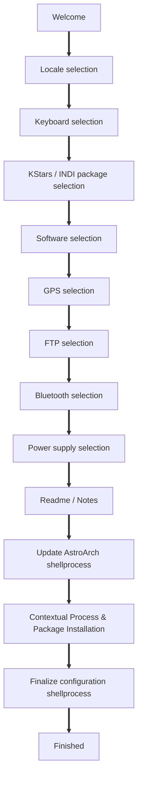
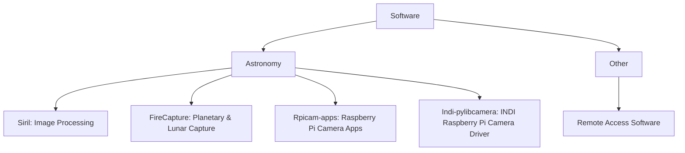
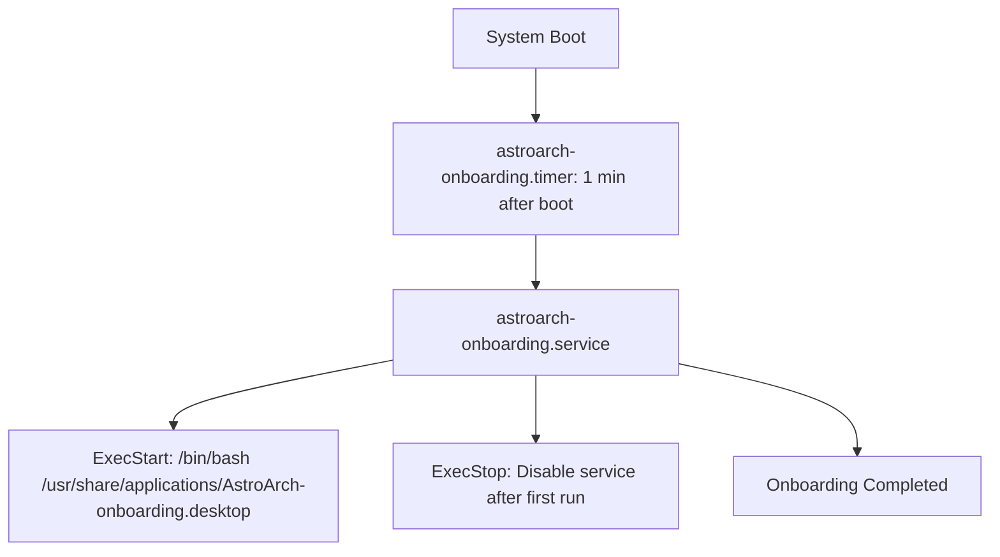

# AstroArch-onboarding (Configuration with Calamares)

This README provides a **detailed guide** to understand and customize the AstroArch configurator process using the Calamares installer framework. It includes configuration examples, sequence explanation, and visual diagrams.

---

## 1. Overview

AstroArch uses **Calamares**, a modular system installer framework. Calamares organizes installation steps into **modules** (viewmodules and jobmodules). Each module handles specific tasks, such as software selection, system configuration, or executing shell commands.

### Key Concepts

- **Viewmodules**: These provide the user interface for configuration steps (e.g., choosing locale, keyboard layout, software packages).
- **Jobmodules**: These perform actions during installation (e.g., writing configuration files, installing packages, running shell scripts).
- **Sequence**: The order in which modules are shown (`show`) and executed (`exec`).
- **Instances**: Different configurations of the same module. Each instance can have a unique `id` and configuration file.

---

## 2. Branding

The branding.desc file contains descriptions, URLs, and more. It also configures the slideshow. This can be done using a QML file or an image sequence.

```yaml
# To configure images, like the filenames (here, as an inline list):
#   slideshow: [ "/etc/calamares/slideshow/0.png", "/etc/logo.png" ]
#slideshow:               "show.qml"
slideshow: [ "/usr/share/calamares/branding/astroarch/slide1.png", "/usr/share/calamares/branding/astroarch/slide2.jpg", 
"/usr/share/calamares/branding/astroarch/slide3.jpg", "/usr/share/calamares/branding/astroarchslide4.jpg", 
"/usr/share/calamares/branding/astroarch/slide5.jpg", "/usr/share/calamares/branding/astroarch/slide6.png", 
"/usr/share/calamares/branding/astroarch/slide7.png", "/usr/share/calamares/branding/astroarch
slide8.jpg", "/usr/share/calamares/branding/astroarch/slide9.jpg", "/usr/share/calamares/branding/astroarch/slide10.png" ]
```

## 3. Settings.conf

The `settings.conf` file is the top-level configuration for Calamares. It defines:

- Module search paths
- Module instances
- Installation sequence
- Branding
- Execution behavior (chroot, prompts, buttons)

Example configuration snippet:

```yaml
instances:

- id: update
  module: shellprocess
  config: shellprocess-update.conf

- id:       kstars_indi
  module:   packagechooserq
  config:   packagechooserq_kstars_indi.conf

- id:       gps
  module:   packagechooser
  config:   packagechooser_gps.conf

sequence:
- show:

  - packagechooserq@kstars_indi

  - packagechooser@gps
    
- exec:

  - shellprocess@update

- show:
  - finished

branding: astroarch
dont-chroot: true
prompt-install: false
```

**Explanation for users**: The sequence shows the steps a user will see and the underlying actions executed.

**Explanation for developers**: By editing the `instances` and `sequence`, you can add new modules or change execution order.

---

## 4. Module Types

### 4.1 Netinstall  (  - netinstall@softwares)

Allows users to select software packages during installation. Example:

```yaml
- name: "Astronomy"
  description: "Astronomy software"
  subgroups:
    - name: "Siril"
      description: "Siril is an astronomical image processing tool"
      packages: [ siril ]
    - name: "FireCapture"
      packages: [ firecapture ]
```

**User**: Pick software you want installed.

**Developer**: Add more subgroups or packages as needed in file:
/home/astronaut/.astroarch/configs/netinstall_software.yaml

### 4.2 Shell Process (  - shellprocess@update)

Executes shell commands during installation.

```yaml
script:
  - command: "/bin/zsh -i -c update-astroarch"
    timeout: 300
```

**User**: This is automatic; no interaction needed.

**Developer**: Add custom commands or scripts.

### 4.3 Notes / README (  - notesqml@readme)

Displays Markdown or QML notes to users.

### 4.4 Package Chooser (  - packagechooserq@kstars_indi / - packagechooser@gps/ftp/bluetooth/power)

Installs software or service Id with module contextualprocess.

  - packagechooser@gps

```yaml
default: gps_off
items:
     - id: gps_on
       name: "Install GPS"
       description: "Install USB GPS in AstroArch. The system time will be updated from GPS. To use your GPS in Kstars, add it as auxiliary hardware"
       screenshot: ":/images/gps_on.svg"

     - id: gps_off
       name: "No GPS"
       description: "No GPS.<br /> The system will use network time"
       screenshot: ":/images/gps_off.svg"
```

  - contextualprocess

```yaml
"packagechooser_gps":
        "gps_on":
                - command: "-/bin/zsh -i -c gps_on"
                  timeout: 40
        "gps_off":
                - command: "-/bin/zsh -i -c gps_off"
                  timeout: 40
```

---

## 5. Systemd Onboarding Service

AstroArch can run a post-installation onboarding script using systemd service and timer:

**Service (`astroarch-onboarding.service`)**:
```ini
[Unit]
Description=AstroArch onboarding configurator
[Service]
User=root
Group=root
ExecStart=/bin/bash /usr/share/applications/AstroArch-onboarding.desktop
ExecStop=/bin/systemctl disable astroarch-onboarding.service
Type=oneshot
[Install]
WantedBy=multi-user.target
```

**Timer (`astroarch-onboarding.timer`)**:
```ini
[Unit]
Description=Timer astroarch-onboarding
[Timer]
OnBootSec=1min
Unit=astroarch-onboarding.service
[Install]
WantedBy=timers.target
```

**Explanation**: Runs onboarding 1 minute after boot, then disables itself.

---

## 6. Polkit Rules in /home/astronaut/.astroarch/configs/

Allows certain processes like Calamares to run without password authentication in VNC or XRDP sessions:

```javascript
/* Allow Calamares without password authentication */
polkit.addRule(function(action, subject)  {
   if (action.id == "org.freedesktop.policykit.exec" && action.lookup("program") == "/usr/bin/env") {
       return polkit.Result.YES;
   }
});
```

---

## 7. Diagrams

### 7.1 Installation Sequence



### 7.2 Software Groups



### 7.3 Onboarding Service Timer



---

## 8. Developer Notes

- **Adding Modules**: Create new module folders under `modules/` and reference them in `instances` and `sequence`.
- **Customizing Packages**: Edit YAML files under `configs/`.
- **Changing Branding**: Modify `branding/astroarch` for custom UI themes and images.
- **Debugging**: Run `calamares -d` for verbose output.

---

## 9. User Guidance

1. Boot AstroArch.
2. Follow the sequence of installation screens.
3. Select software and system preferences.
4. Wait for update and final configuration scripts to complete.
5. Reboot when finished.

---


